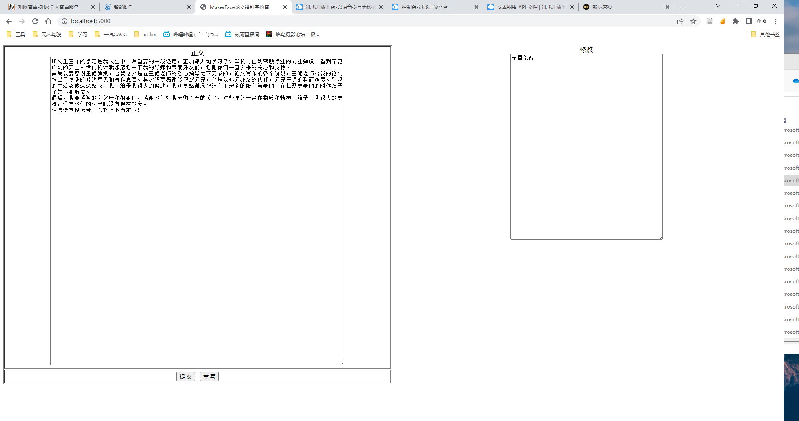

# 中文错词错字纠正

1. 安装Flask
2. 执行`flask run`

# 介绍

## [讯飞API 自然语言处理](https://console.xfyun.cn/services/text_check)

[具体手册](https://www.xfyun.cn/doc/nlp/textCorrection/API.html)

## 项目组成

1. app.py主要基于demo python3实现，加入flask，可以在网页端输入并显示更正
2. index.html和app.py中的main函数一样

## 最终效果
